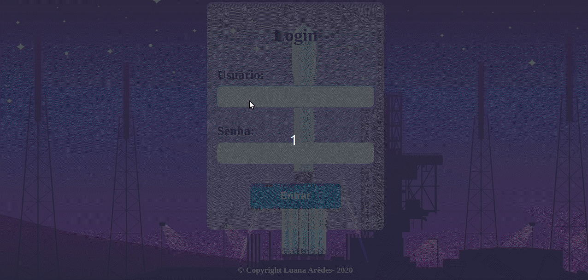

# Cifra de César- Mensagem Segura Para o Espaço

## 1. Resumo

 
O objetivo principal do projeto é que o usuário consiga criptografar e descriptografar uma mensagem, escolhendo a chave de deslocamento com quantas posiçoes desejar. A lógica do projeto foi implementada em javaScript, fazendo uso da teçnica cifra de Cesar.

A cifra de César é uma das técnicas mais simples de cifrar uma mensagem. É um
tipo de cifra por substituição, em que cada letra do texto original é
substituida por outra que se encontra há um número fixo de posições
(deslocamento) mais a frente do mesmo alfabeto.

Por exemplo se usarmos o deslocamento (_offset_) de 3 posições:

- Alfabeto sem cifrar: A B C D E F G H I J K L M N O P Q R S T U V W X Y Z
- Alfabeto com cifra: D E F G H I J K L M N O P Q R S T U V W X Y Z A B C
- A letra A será D
- A palavra CASA será FDVD

:pushpin: Clique [aqui](https://luana-aredes.github.io/SAP004-cipher/) para acessar o SpaceJobs.

**Caso não queira se cadastrar, faça login utilizando os seguintes dados**  
Usuário: **luana@gmail.com**  
Senha: **102030** 

 
## 2. Usuários
 
 O projeto visa atender á necessidade de comunicação entre os integrantes da base de lançamento espacial do Brasil e os tripulantes da estação espacial internacional (história ficticia). 

## 3. Funcionalidades
O projeto permite ao usuário enviar mensagens codificadas, garantido a segurança dos dados e do usuário em questão.   

Após fazer login o usuário será direcionado para a tela principal, onde encontra-se do lado direito da tela o formulário a ser preenchido com nome do usuário, mensagem a ser criptografada/descriptografada, chave de deslocamento desejada e a opção de selecionar o destinatário.
Ao lado esquerdo da tela possui uma animação com um pequeno foquete, remetendo a idéia de que a mensagem esteja sendo enviada através de um foguete para o outro usuário.  

Para criptografar uma mensagem e envia-la, o usuario deverá inserir seu nome, a mensagem na qual deseja criptografar, a chave de deslocamento desejada e selecionar o nome do destinatário, nos respectivos campos. Após preencher os campos, deverá clicar no botão criptografar, e assim a mensagem criptografada aparecerá no campo "mensagem". Logo após, deverá clicar no botão "Enviar mensagem" e pronto, a mensagem será enviada com segurança ao destinatário.

Para descriptografar uma mensagem o usuario deverá:
Inserir seu nome, a mensagem na qual deseja descriptografar e a chave usadada para criptografar essa mensagem. Depois clicar no botão "descriptografar", então a mensagem descriptografada aparecerá no campo "mensagem". Caso o usuario queira enviar essa mensagem descriptografada para alguem, ele deverá selecionar o destinatario no campo "destinatário" e clicar no botão "enviar mensagem".  

## 4. Linguagens Utilizadas

Foram utilizadas HTML5, CSS3 e JavaScript, sendo este separado em index.js, cipher.js e home.js, onde index.js foram colocadas as funções de botão, o cipher.js as funções para codificação e decodificação e o home.js as funções de botão e login.

## 5. Instalação

- Instale as dependências do projeto rodando o comando `npm install`. Mas
  antes disso tenha certeza de ter instalado o [Node.js](https://nodejs.org/)
  (que inclui o [npm](https://docs.npmjs.com/)).
- Caso queira, você conseguirá executar os :traffic_light: testes
  unitários com o comando `npm test`.
- Para ver a interface do programa no seu servidor local, use o comando `npm start`.

## 6. Autora

Primiero trabalho desenvolvido durante o bootcamp de programação front-end da Laboratória (SAP004) por Luana Arêdes.

## 7. Considerações finais

O produto para estar concluído precisa de algumas implementações, que no caso não serão feitas agora. O objetivo é que o usuário consiga enviar mensagens, sejam elas sigilosas ou não, com segurança e privacidade.

